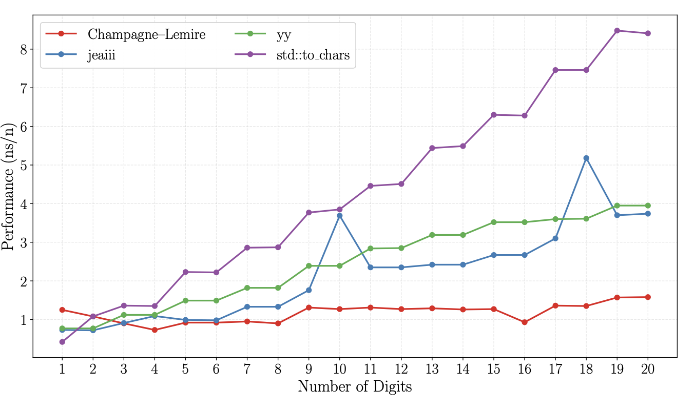

**SIMD-accelerated integer-to-string conversion**

Converting a 64-bit integer to its decimal string representation is a mundane task that shows up everywhere: logging, JSON serialization, CSV output, debug prints, etc. In C++, you might use `std::to_chars`, `sprintf`, or some library routine.

How do these functions work? At a high level, they repeatedly divide by ten. Start with your integer `k`. Divide it by ten, use the remainder as the last digit (it is between 0 and 9 inclusively). You then add the code point value of the character `0` to get the ASCII digit.
To go faster, you can divide by 100 and use a lookup table so that the value between 0 and 99 inclusively is mapped to a string.


So far so good. Unfortunately, even with all these optimizations, this string generation may become a performance bottleneck. Can you do better?

Let us assume that you have a recent AMD processor or an Intel server. Then you have powerful data-parallel instructions (AVX-512) that can multiply eight 64-bit integers at once. We often refer to these instructions as SIMD (single instruction multiple data). My colleague Jaël Champagne Gareau and I recently published a new paper on exactly this problem. The title says it all: [Converting an Integer to a Decimal String in Under Two Nanoseconds](https://onlinelibrary.wiley.com/doi/10.1002/spe.70079).


When you write `n / 100` in code, an optimizing compiler converts the operation to a multiplication followed by a shift. It is often described as a multiplicative inverse. Generally, you can replace the division of `n` by `d` with the division of `c * n` or `c * n + c` by `m` for convenient integers `c` and `m` chosen so that they approximate the reciprocal: `c/m ~= 1/d`. We often call `c * n + c` a fused multiply-add.
Picking `m` to be a power of two means that the division by `m` is just a shift. Then you can get the remainder of the division by using the remainder of the division by `m`, multiplied by `d` and divided again by `m`, which is essentially a multiplication followed by a shift ([Lemire et al., 2021](https://arxiv.org/abs/2012.12369)).

We can put this to good use with the Integer Fused Multiply-Add (IFMA) instructions available on recent Intel and AMD processors. They essentially allow you to compute eight instances of `(c * n + c)/m` in one instruction.
The expression `(c * n + c)/m` gives you the division, but we need the remainder, so instead we pick 
`(c * n + c)%m` which we need to multiply by the divisor.

The fun thing with AVX-512 instructions is that they can use a different `c` and a different divisor for each of the eight operations.
Using Intel intrinsic functions, our core routine which converts a value smaller than `10^8` to eight digits looks as follows:

```cpp
__m512i to_string_avx512ifma_8digits(uint64_t n) {
  __m512i bcstq_l   = _mm512_set1_epi64(n);
  constexpr uint64_t twoto52 = 0x10000000000000ULL; // 2^52
  __m512i ifma_const = _mm512_setr_epi64(
    twoto52 / 100000000, twoto52 / 10000000, twoto52 / 1000000, twoto52 / 100000,
    twoto52 / 10000, twoto52 / 1000, twoto52 / 100, twoto52 / 10
  );
  __m512i zmmTen    = _mm512_set1_epi64(10);
  __m512i asciiZero = _mm512_set1_epi64('0');
  __m512i lowbits_l  = _mm512_madd52lo_epu64(ifma_const, bcstq_l, ifma_const); // ifma_const * bcstq_l + ifma_const
  __m512i highbits_l = _mm512_madd52hi_epu64(asciiZero, zmmTen, lowbits_l);
  return highbits_l;
}
```

It compiles down to two multiplication-add instructions: `vpmadd52huq`. That's it. Two instructions to generate eight digits.

It works by broadcasting `n` across all eight 64-bit lanes of a `__m512i` vector (`bcstq_l`). It then prepares a vector of carefully chosen multiplicative inverses (`ifma_const`) that represent the reciprocals of `10^8`, `10^7`, ... The magic happens in the single `_mm512_madd52lo_epu64` instruction, which simultaneously performs eight fused multiply-adds: each lane computes `(ifma_const[i] * n + ifma_const[i])` using 52-bit low-half multiplication, effectively extracting the quotient when dividing by the corresponding power of ten. A second `_mm512_madd52hi_epu64` instruction (with a vector of ten and a vector of `'0'`) then isolates the digit values and adds the ASCII `'0'` offset in the high 52 bits, producing eight packed digit characters in a single 512-bit register.

If all your integers require eight digits, you are done. But in the general case, putting this to good use requires a bit of effort.

Thankfully, even if you, say, need only six digits, you can do the full 8-digit computation and then use a *masked store* if you want to store only six digits, ignoring the two leftovers. That is, instruction sets like AVX-512 allow you to write only some of the data to memory, which is quite convenient.

We have two variants. One is branch-heavy and does well on homogeneous data (numbers with similar digit lengths). The other is branch-light and better for mixed workloads. A quick profiling step can pick the right one for your dataset.

Our implementation is consistently 1.4–2× faster than the best competitors and 2–4× faster than `std::to_chars` across a wide range of inputs. What I find interesting is that even if the  `std::to_chars` implemenetation is not at all naive, you can do significantly better in many ways. James Anhalt's approach (`jeaiii`) is also quite fast on modern hardware.




**Further reading**  
- The paper: [arXiv:2604.26019](https://arxiv.org/abs/2604.26019)  
- The benchmarks are on [GitHub](https://github.com/fastfloat/int_serialization_benchmark) (fully reproducible) 
- Shortly after our paper came online, Barend Erasmus created [a software library implementing our proposed approach](https://github.com/simditoa/simditoa). I am not certain that Barend includes both the homogeneous and heterogeneous approaches.

