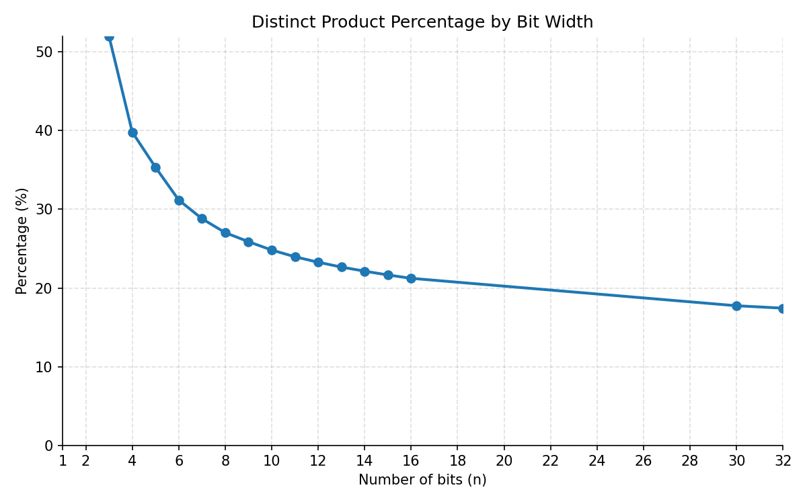

In software programming, the product between two integers is often computed to a fixed number of bits with overflow. Consider 8-bit integers. If you multiply 127 by 127, you get back the number 1 as an 8-bit unsigned integer, with an overflow. The actual full product is 16129. To represent 16129, you typically use 16 bits of precision.

Thus we have the notion of the full product. The full product of two 32-bit integers is typically represented using 64 bits. The question that preoccupied me is what fraction of all 64-bit integers can be written as the product of two 32-bit integers.

You might wonder why you would care?

We often design hash functions: they are special functions that take an input and generate a random-looking output.
Several years ago I designed a very fast hash function called [clhash](https://github.com/simdhash/clhash). It is a super-fast hash function for strings having a few hundred bytes or more. If you don't know about clhash, [check it out](https://github.com/simdhash/clhash). It is interesting in its own right.


This clhash hash function uses a type of multiplication typical of cryptographic applications. I was trying to argue that our approach had benefits compared with techniques based on standard multiplications. Let me illustrate. A simple hash function for 32-bit integers could take the least significant bits and multiply them with the most significant bits.


```cpp
// simpleHighLowHash is a simple (and weak) 32-bit hash
// that multiplies the high 16 bits by the low 16 bits.
func simpleHighLowHash(x uint32) uint32 {
    high := uint16(x >> 16)
    low := uint16(x & 0xFFFF)
    return uint32(high) * uint32(low)
}
```

Maybe you'd want the hash function to be uniform: all possible 32-bit hash values should be equally probable. It is only possible in this instance if the hash function can produce all 32-bit hash values, which is not the case.

The great mathematician Erdös showed that the proportion of all `2n`-bit values that can be generated by the product of two n-bit values goes to zero as `n` becomes large. This means that if you have, say, 10000000-bit integers multiplying 10000000-bit integers, you'd expect relatively few 100000000000000-bit integers to be produced. But what about practical cases like 32-bit integers or 64-bit integers?

You can just brute-force the problem easily up to the multiplication of 16-bit integers into 32-bit products. At that point, slightly one out of five 32-bit numbers is a product between two 16-bit integers. About 80% of all 32-bit integers are never produced by this hash. However, the running time grows exponentially, and brute force won't scale all the way to 32 bits.


So what do we do about the 32-bit case? That is, what do you do when you multiply two 32-bit integers to produce a 64-bit product? What fraction of 64-bit values can the following function produce?


```cpp
func simpleHighLowHash(x uint64) uint64 {
    high := uint32(x >> 16)
    low := uint32(x & 0xFFFFFFFF)
    return uint64(high) * uint64(low)
}
```

Can we get an exact result?

Yes!!!

[Webster](https://blue.butler.edu/~jewebste/) and his colleagues [built the math](https://arxiv.org/pdf/1908.04251) to allow us to scale up the exact computation. [He was kind enough to publish his code](https://github.com/jewebste/multiplication-table-problem).

There are 3,215,709,724,700,470,902 64-bit (unsigned) integers that can be written as a product of two 32-bit integers. That's about 17% of all possible values.




What about actually computing a pair of integers given their product? One approach consists of computing its full prime factorization, and then using those factors to build all possible divisors that are strictly less than `2^32`, starting with a set of candidates containing only `1` and iteratively multiplying existing candidates by each prime factor (only keeping products that stay below `2^32`). We can avoid adding duplicates to our set by processing unique prime factors with their multiplicity. Finally, we select the maximum such candidate `m` as the largest divisor under `2^32`, compute the corresponding leftover `n // m`, and report whether a valid split into two 32-bit factors exists. In general, the answer (if it exists) is not unique: this returns the pair where one value is maximized. In Python, the code might look as follows.

```python
for p in factor_multiplicities:
    new_candidates = []
    for c in candidates:
        for i in range(factor_multiplicities[p] + 1):
            if c * (p ** i) < 2**32:
                new_candidates.append(c * (p ** i))
    for new_c in new_candidates:
        candidates.append(new_c)

m = max(candidates)
print(f"Maximum candidate: {m}")

leftover = n // m
print(f"Leftover: {leftover}")

if leftover >= 2**32:
    print("Leftover is too large, cannot find a suitable candidate.")
```

You might be able to come up with a more efficient algorithm. I find it interesting to consider that if you pick a value at random, it will usually fail! That is, most 64-bit integers cannot be written as the product of two 32-bit integers.