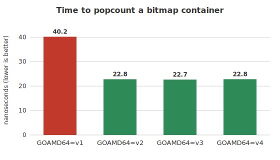
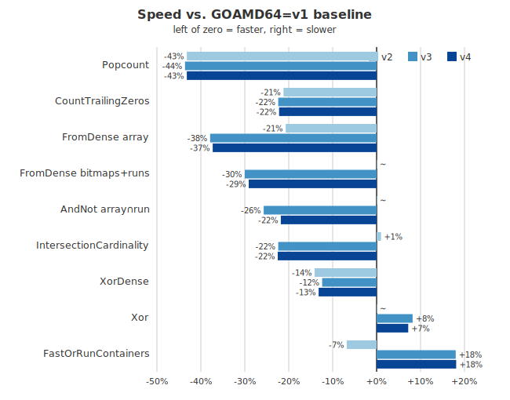

# How much do amd64 microarchitecture levels help Roaring Bitmaps in Go?

When you compile a Go program for a 64-bit Intel or AMD processor, the
compiler targets, by default, a nearly 20-year-old instruction set. The
binary that comes out runs on essentially any x64 chip, but it also leaves
on the table every instruction that was added since 2003: the dedicated
population-count instruction (`popcnt`), the trailing-zero count (`tzcnt`),
the AVX/AVX2 vector instructions, AVX-512, and so on.

To make this tractable, the industry agreed on a small ladder of
[*microarchitecture levels*](https://en.wikipedia.org/wiki/X86-64#Microarchitecture_levels).
Each level bundles a set of instruction-set extensions that you can assume
are present:

| Level | Adds (roughly) |
|-------|----------------|
| **v1** | the original AMD64 baseline (SSE2) |
| **v2** | `popcnt`, SSE3/SSSE3/SSE4.1/SSE4.2, `cmpxchg16b` |
| **v3** | AVX, AVX2, BMI1/BMI2, FMA, `movbe` |
| **v4** | AVX-512 (F/BW/DQ/VL) |

The Go toolchain exposes this ladder through the
[`GOAMD64`](https://go.dev/wiki/MinimumRequirements#amd64) environment
variable. Setting `GOAMD64=v3` tells the compiler it may use everything up
to and including AVX2. The default is `v1`, the lowest common denominator.

This raises an obvious question. If I take a real, performance-sensitive
library and recompile it at each level, how much do I actually gain? I
picked [Roaring Bitmaps](https://github.com/RoaringBitmap/roaring), a
compressed bitset data structure used in databases and search engines
([Lucene](https://lucene.apache.org/), [ClickHouse](https://clickhouse.com/),
and others). Its hot loops are full of population counts, intersections, and
unions over machine words — exactly the kind of code that ought to benefit
from newer instructions.

## The benchmark

The methodology is deliberately boring. I fetch the latest release of the
library, then run its own benchmark suite four times — once per level —
collecting eight samples each, and feed the lot to
[`benchstat`](https://pkg.go.dev/golang.org/x/perf/cmd/benchstat) with `v1`
as the baseline:

```bash
for lvl in v1 v2 v3 v4; do
    GOAMD64="$lvl" go test -run='^$' -bench=. -benchmem \
        -benchtime=500ms -count=8 \
        github.com/RoaringBitmap/roaring/v2 | tee "results/bench-$lvl.txt"
done

benchstat v1=results/bench-v1.txt v2=results/bench-v2.txt \
          v3=results/bench-v3.txt v4=results/bench-v4.txt
```

The full driver script, the raw output, and the figures are in
[this directory](.); see [`run_benchmarks.sh`](run_benchmarks.sh).

I ran this on a single Intel Xeon Gold 6548N (Emerald Rapids, which supports
all four levels including AVX-512) under Go 1.26.2 and Roaring v2.18.2.

## The headline: population counts

The single clearest result is the population count — counting the number of
set bits in a bitmap container. The `v1` baseline cannot use the `popcnt`
instruction, so Go emits a software fallback. The moment we move to `v2`,
`popcnt` becomes available and the time is cut almost in half:



That is a 43% reduction, and it is free: no source change, just a compiler
flag. Notice, though, that `v3` and `v4` do nothing more. A single `popcnt`
instruction is already optimal; AVX2 and AVX-512 have nothing to add here.
The same story holds for trailing-zero counts (`tzcnt`, –21% at `v2`).

## The fuller picture

Population count is the easy win. What about the rest of the library?
Here is the percentage change versus the `v1` baseline for a representative
slice of the suite, at each level (negative means faster):



A few patterns jump out.

**`v2` is close to a free lunch.** Turning on the post-2003 scalar
instructions almost never hurts, and it sometimes helps a lot: `popcnt` and
`tzcnt` as above, but also `XorDense` (–14%) and `FromDense array` (–21%).
There is very little reason to ship `v1` binaries to modern hardware.

**`v3` (AVX2) is where vectorization pays off — usually.** Building dense
containers gets dramatically cheaper (`FromDense array` –38%,
`FromDense bitmaps+runs` –30%), and several set operations improve
(`IntersectionCardinality` –22%, `AndNot array∩run` –26%). These are the
loops the compiler can auto-vectorize once 256-bit registers are on the
table.

**But `v3` is not a free lunch.** A handful of benchmarks *regress*.
`FastOrRunContainers` is the striking one: `v2` makes it 7% faster, then
`v3` makes it 18% *slower* than the original `v1`. `Xor` over large bitmaps
also slips about 8%. Wider instructions change the compiler's inlining and
register-allocation decisions, and not always for the better. If you care
about a specific workload, you have to measure it rather than assume v3 ≥ v2
≥ v1.

**`v4` (AVX-512) buys nothing.** This is the most interesting non-result.
Across the entire suite, `v4` is statistically indistinguishable from `v3`.
The Go compiler does not auto-vectorize this code to 512-bit registers, and
the library has no AVX-512 assembly, so enabling the level simply gives the
compiler permission it never uses. On this hardware there is also a real
risk to AVX-512: heavy use can lower clock frequencies, so "no benefit" is
arguably the good outcome.

## Selected numbers

For the record, here are the absolute timings for some of the operations
above, baseline versus the best level:

| Operation | v1 | best | change |
|-----------|-----|------|--------|
| Popcount | 40.2 ns | 22.7 ns (v3) | **–43%** |
| CountTrailingZeros | 56.0 ns | 43.5 ns (v3) | **–22%** |
| FromDense array (4096) | 29.8 µs | 18.5 µs (v3) | **–38%** |
| FromDense bitmaps+runs | 24.8 µs | 17.3 µs (v3) | **–30%** |
| AndNot array∩run | 2.53 µs | 1.88 µs (v3) | **–26%** |
| IntersectionCardinality | 131 ns | 101 ns (v3) | **–22%** |
| XorDense | 72.5 µs | 62.3 µs (v2) | **–14%** |
| FastOrRunContainers | 1.27 ms | 1.50 ms (v3) | **+18%** ⚠ |

## Takeaways

1. **Do not ship `GOAMD64=v1` to modern servers.** Moving to `v2` is almost
   pure upside — population counts alone nearly halve in cost — and v2
   hardware (Nehalem, 2008, and later) is universal in any data center.
2. **`v3` is usually worth it, but verify your own hot paths.** Most
   operations get faster, a few get slower. The default assumption "newer is
   better" does not survive contact with `FastOrRunContainers`.
3. **`v4` / AVX-512 is, here, a no-op.** Until the Go compiler learns to
   target wider vectors automatically — or the library ships AVX-512
   kernels — there is nothing to gain from it for this workload, and a
   frequency-throttling risk if it were used.

The broader lesson is one I keep relearning: the gap between "what the
hardware can do" and "what the compiler emits by default" is large, and it
is mostly invisible until you go looking for it. A one-line environment
variable recovered 20–40% on the operations that matter most, and cost
nothing but the time to measure.

The scripts and raw data to reproduce all of this are in
[this directory](.). Your numbers will differ — silicon, Go version, and
library version all move — so run it yourself before trusting any single
figure.
