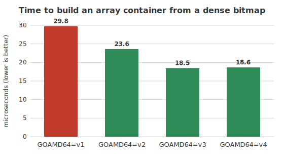
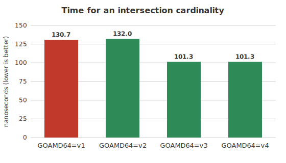

# How much do amd64 microarchitecture levels help in Go?

64-bit Intel and AMD processors have evolved over decades.

When you compile a Go program for a 64-bit Intel or AMD processor, the
compiler targets, by default, a nearly 20-year-old instruction set. The
binary that comes out runs on essentially any x64 chip, but it also leaves
on the table every instruction that was added since 2003.

We often refer to
[*microarchitecture levels*](https://en.wikipedia.org/wiki/X86-64#Microarchitecture_levels).
Each level bundles a set of instruction-set extensions that you can assume
are present:

| Level | Adds (roughly) |
|-------|----------------|
| **v1** | the original AMD64 baseline (SSE2) |
| **v2** | `popcnt`, SSE3/SSSE3/SSE4.1/SSE4.2, `cmpxchg16b` |
| **v3** | AVX, AVX2, BMI1/BMI2, FMA, `movbe` |
| **v4** | AVX-512 (F/BW/DQ/VL) |

In my view, this ladder is already slightly obsolete. It was frozen around
2020, and the hardware has moved on. We would need to add the latest AVX-512
sub-extensions (VBMI, VBMI2, VNNI, BF16, FP16, VPOPCNTDQ, and so on), which
recent server and consumer chips support but which `v4` does not require. While `v1` through `v4` are a useful common language, a
realistic "use everything this CPU offers" target today would need at least a
`v5`, and arguably the whole scheme should be replaced by finer-grained
feature detection.

In any case, the Go toolchain exposes this `v1` through `v4` ladder via the
[`GOAMD64`](https://go.dev/wiki/MinimumRequirements#amd64) environment
variable. Setting `GOAMD64=v3` tells the compiler it may use everything up
to and including AVX2. The default is `v1`, the lowest common denominator.

This raises an obvious question. If I take a real, performance-sensitive
library and recompile it at each level, how much do I actually gain? I
picked [Roaring Bitmaps](https://github.com/RoaringBitmap/roaring), a
compressed bitset data structure used in databases and search engines. 

A Roaring Bitmap stores a set of 32-bit integers. It splits the 32-bit space
into chunks of 65,536 values, keyed by the high 16 bits, and stores each chunk
in a *container* that holds only the low 16 bits. A container comes in one of
three shapes, and the library always keeps whichever is smallest:

- an array container: a sorted list of 16-bit values, used when the chunk
  is sparse (a few thousand elements at most);
- a bitmap container: a flat 8 KB bit vector (65,536 bits, one per possible
  value), used when the chunk is dense;
- a run container: a list of `[start, length]` intervals, used when the set
  bits cluster into consecutive runs.

I fetched the latest release of the library, then ran its own benchmark suite
four times, once per level, collecting eight samples each. I did this on a
single Intel Xeon Gold 6548N (Emerald Rapids, which supports all four levels,
including AVX-512) under Go 1.26.2 and Roaring v2.18.2.

A *population count* (or *popcount*, also called the Hamming weight) is simply
the number of bits set to 1 in a machine word. Roaring leans on it constantly:
the cardinality of a bitmap container, how many values it holds, is the sum
of the population counts of its 1024 64-bit words. Modern x86 chips have a
dedicated `popcnt` instruction that does this in a single operation, but it
only became available at the `v2` level (SSE4.2, 2008). Without it, the
compiler has to fall back to a multi-instruction bit-twiddling sequence.

The clearest single result is population count: counting the number of
set bits in a bitmap container. The `v1` baseline cannot use the `popcnt`
instruction, so Go emits a software fallback. The moment we move to `v2`,
`popcnt` becomes available and the time is cut almost in half:

That is a 43% reduction, and it is free: no source change, just a compiler
flag. Notice, though, that `v3` and `v4` do nothing more. A single `popcnt`
instruction is already optimal; as far as the Go compiler is concerned, AVX2
and AVX-512 have nothing to add.

Population count is the easy win. What about the rest of the library?

Another clear win is building a container from a dense bitmap. The
`FromDense array` benchmark takes a raw 8 KB bit vector and constructs the
most compact container for it: it popcounts every word to learn the
cardinality, then scans out the positions of the set bits. That word-at-a-time
popcount-and-scan loop is exactly what the compiler can auto-vectorize once
256-bit registers are available, so the gains keep coming past `v2`:

`v2` already cuts 21% by using scalar `popcnt`/`tzcnt` instructions, and `v3`
(AVX2) nearly doubles that to a 38% reduction. As with popcount, `v4` adds
nothing.

Set operations show the same pattern. The `IntersectionCardinality` benchmark
counts how many values two bitmaps have in common: for bitmap containers, it
ANDs the words pairwise and population-counts the result, without ever
materializing the intersection. Here `v2` does essentially nothing (the scalar
`popcnt` is already in the inner loop), but `v3` lets the compiler widen the
AND-and-count loop to 256-bit registers, cutting the time by 22%:

Takeaways:

1. On modern hardware, everyone should be using `v2` or better. The resulting binary will run in any data center and on any non-ancient laptop.
2. The `v3` level might be worth investigating.
3. The `v4` level should have helped in some of my benchmarks, but it did not. I suspect that the Go compiler is just not great at it.

(Obviously: run your own benchmarks.)