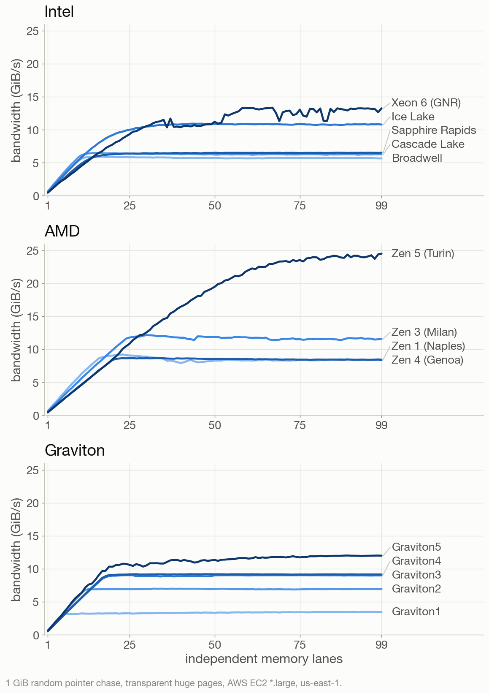

# Memory-level parallelism: AMD is the king

When your program asks for memory that is not in cache, the processor has to go
to RAM. That trip costs on the order of 100 nanoseconds. On a 3 GHz core, that
is about 300 cycles of doing nothing.

Memory latency has not
improved in ten years. The 2016 Broadwell answers a random access in 100 ns.
The 2025 Turin, with DDR5-6400 and every advantage of a decade of progress,
takes 140 ns. It got worse.

The good news is that a modern core does not have to sit still. It can issue a
second request before the first one comes back, and a third, and a tenth. The
number of requests a single core can keep in flight is its memory-level
parallelism. It is one of the most important numbers in software performance,
and one of the least advertised: you will not find it on a spec sheet.

Thankfully, memory-level parallelism has improved
a lot.
To measure it, I use my [testingmlp](https://github.com/lemire/testingmlp) benchmark. The idea
is a pointer chase. We build a 1 GiB array containing a single random cycle
covering every element: each element holds the index of the next. Following the
cycle is inherently serial. Each load has to complete before you know the
address of the next one, so a single chase measures pure memory latency and
nothing else. Then we run several such chases at once, from different starting points on the same cycle. We call these *lanes*. With two lanes, the core has two independent loads to work on. With twenty, twenty. We increase the number of lanes and watch the throughput. When adding a lane stops helping, we have found the limit. As my metric, I use the total estimated bandwidth.

I ran experiments on the Amazon cloud (AWS). The bandwidth shape is the same everywhere: a steep, nearly linear climb as we add lanes, then a knee, then
a plateau.

**Intel**

| Instance | Year | Processor | Memory | Latency | Peak BW | Concurrency |
|---|---|---|---|---|---|---|
| m8i.large | 2025 | Xeon 6975P-C, Granite Rapids | DDR5-7200 | 133 ns | 13.3 GiB/s | 30 |
| m8a.large | 2025 | EPYC 9R45, Zen 5 (Turin) | DDR5-6400 | 142 ns | 24.5 GiB/s | 58 |
| m9g.large | 2026 | Graviton 5, Neoverse V3 | DDR5-8800 | 96 ns | 12.0 GiB/s | 19 |

How did it evolve over time?
Intel went from 10 to 30, meaning that a single Intel core can sustain 30 memory requests at once in practice.
AMD went from 15 to 58. Graviton went from 6 to
19.

Intel was flat for a long time. Broadwell and Cascade Lake both sit at 10
concurrent misses. Ice Lake doubled it to 20. Granite Rapids is at 30. Intel has roughly
tripled in a decade, with all the gain arriving in the last two generations.

AMD started ahead and stayed ahead, then jumped. Naples was already at 15 in
2018, when Intel was at 10. Milan reached 22. And then Turin does something
different in kind: 58 concurrent cache lines from a single core.

Graviton 1 was
a toy: 6 concurrent misses. Graviton 2 doubled
it, Graviton 3 went to 17, and then Graviton 4 essentially stood still at 18.
Graviton 5 only reaches 19. But look at the latency panel: since 2017, Graviton 5
is the only chip in this entire collection that made a random access *faster*
than its predecessor. [AWS
advertised better DRAM latency for Graviton 5](https://www.amazon.science/blog/graviton5s-improved-design-increases-speed-and-energy-efficiency-beyond-moores-law), and that claim holds
up.

So who wins? On bandwidth and memory-level parallelism, it is
AMD, and it is not close.
The Zen 5 core in the `m8a` instances sustains 58 concurrent cache-line fetches
and 24.5 GiB/s of random-access throughput from one core. AMD is roughly
twice as fast as Intel.

*The raw output, the system information from each machine, and the scripts are
[in the usual place](https://github.com/lemire/Code-used-on-Daniel-Lemire-s-blog/tree/master/2026/07/25).*
