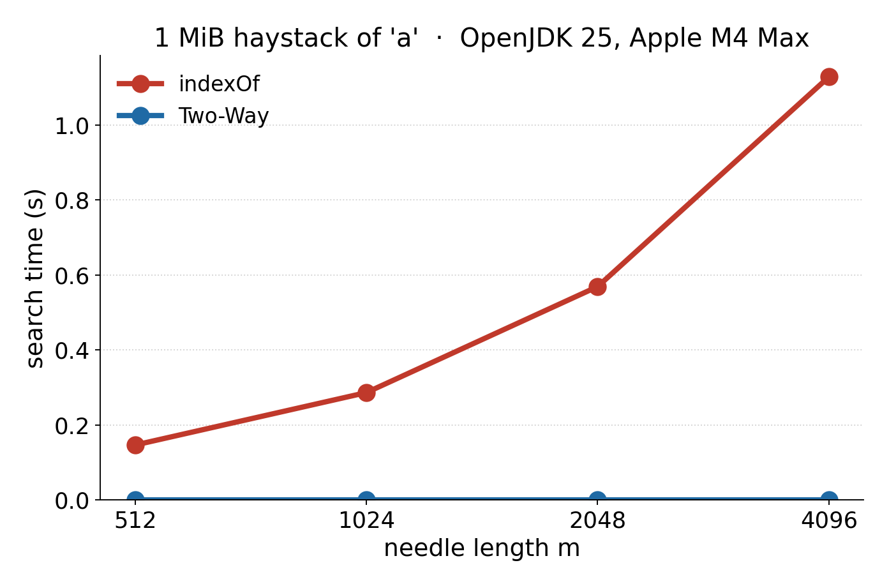

# Java's String.indexOf can be slow (quadratic)


In Java, you find the location of a substring using `indexOf`.

```java
String haystack = "The quick brown fox jumps over the lazy dog";
String needle = "fox";
int index = haystack.indexOf(needle);
```

Naively, you might implement `indexOf` by a loop inside a loop, like so.

```java
int naiveIndexOf(String haystack, String needle) {
    for (int i = 0; i <= haystack.length() - needle.length(); i++) {
        int j = 0;
        for (; j < needle.length() 
          && haystack.charAt(i + j) == needle.charAt(j); j++) {}
        if (j == needle.length()) { return i; }
    }
    return -1;
}
```


The Java implementation is much more sophisticated, and it is highly accelerated. 

However, there are pathological cases where the Java implementation can be slow. What do I mean? Well, you do expect that the search will be more and more expensive as the size of the string grows. Rigth? So if you search through a 1 kilobyte string and then search through a 10 kilobyte search, you would not be surprised if the latter takes ten times slower.

But what of the substring? If you search for short substrings (`fox` in my example), the everything is fine. But what if you search longer and longer substrings (`fox jumps` or `fox jumps over`)? If it gets more expensive when both the string and the substring get longer, then you have what we call a quadratic complexity. In other words, it is slow.

In Java, if *n* is the length of your string and *m* is the length of the substring, then the complexity of `indexOf` is O(*n*·*m*). And if you look at my naive implementation (`naiveIndexOf`) then you see that in the worst case, it might do up to close to `haystack.length() * needle.length()` comparisons, that is, it is O(*n*·*m*).

The exact implementation of the `indexOf` function depends on your CPU and Java version. I am using OpenJDK 25 on Apple Silicon (ARM). For my purposes, I will use as a haystack of *n* copies of `a` and for the needle, the same thing, but ending with a different letter.

```java
// n > m
String haystack = "a".repeat(n);
String needle = "a".repeat(m - 1) + "b";
```


I measured OpenJDK 25 on an Apple M4 Max. The haystack is one megabyte. Numbers are nanoseconds per haystack character.

| *m* | `indexOf` |
| ---: | ---: |
| 512 | 140 |
| 1024 | 273 |
| 2048 | 543 |
| 4096 | 1076 |

At *m* = 4096, a single `indexOf` over one megabyte takes 1.1 seconds. 

Can you do better against such adversarial inputs? The textbook solution is the Two-Way algorithm of Crochemore and Perrin (1991). The implementation is simple and your favourite AI can code it for you in any programming language.

| *m* | `indexOf` | Two-Way |
| ---: | ---: | ---: |
| 8 | 0.44  | 0.29 |
| 32 | 0.48  | 0.29 |
| 128 | 0.45  | 0.30 |
| 256 | 73.9  | 0.32 |
| 1024 | 273  | 0.32 |
| 4096 | 1076  | 0.31 |



Two-Way stays at about 0.3 ns/character no matter how long the needle is. At *m* = 4096 it is about 3500 times faster than `indexOf` on the first-character adversary.

So, should you switch to Two-Way for everything? No. On random text, the `indexOf` function is much faster than Two-Way.

| *m* | `indexOf` | Two-Way |
| ---: | ---: | ---: |
| 8 | 0.30 | 0.55 |
| 64 | 0.10 | 0.56 |
| 256 | 0.24 | 0.53 |
| 4096 | 0.22 | 0.55 |

And Two-Way has to do non-trivial work before the search begins. So it has additional fixed overhead. It would lose most of the time in the real world, sometimes by a wide margin. 

Should you worry about this? No. The `indexOf` function in Java is fine.

If an adversary can control the needle (substring), then make sure to reject long needles. Most of the time, we search for short sequences (say, less than 80 characters). If you are worried about your system crashing, you will put bounds on inputs in any case.

[The Java source is available](https://github.com/lemire/Code-used-on-Daniel-Lemire-s-blog/tree/master/2026/08/22).

*Further reading*: Crochemore, M., & Perrin, D. (1991). [Two-way string-matching](http://monge.univ-mlv.fr/~mac/Articles-PDF/CP-1991-jacm.pdf). *Journal of the ACM*, 38(3), 650–674.
