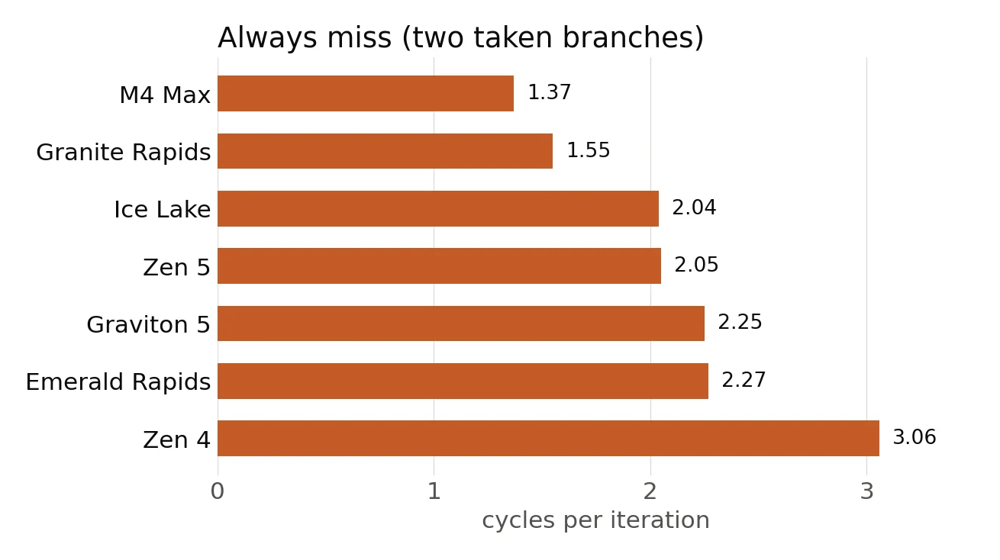

# More than a taken branch per cycle?

Our processors can execute many instructions per cycle; they are *superscalar*. But not all instructions are equal.

Branches are particularly tricky. A branch occurs often when you use an if-then clause or a loop. We
distinguish between a taken branch 
and a not taken branch.

A not-taken branch is often cheap. The processor just keeps going.

A taken branch jumps to a new location. A taken branch can be more expensive.

You will often hear that processors are limited to one taken branch per cycle.

I decided to test it out with a loop with an
`if` inside it. Here is the function I tested in Go.

```go
func lastHit(p []byte, thresh byte, last *byte) {
    n := len(p)
    if n == 0 {
        return
    }
    i := 0
    for {
        v := p[i]
        if v > thresh {
            *last = v
        }
        i++
        if i == n {
            break
        }
    }
}
```

Look at the main loop. We load a value from an array, we compare it with a threshold. If it is greater than the threshold, then we assign it to the `last` pointer. So the function effectively records the last seen value that is greater than the threshold. That's pretty reasonable code.

Consider the case where you always miss. The values are always smaller than or equal to the threshold. In these cases, we get two taken branches in close proximity, but no store. (It is a bit confusing but that's how the Go compiler does it.)




The processor that struggles the most is the AMD Zen 4 processor. But AMD Zen 5 is much better.


So two processors are able to take two branches in less than 2 cycles on average in this test: the Apple processor (M4 Max) and the Granite Rapids processor.

This means that, yes, modern processors can execute more than one taken branch per cycle under some conditions.


The code is under
`benchmark/experiments/ifloop` in the
[GitHub repo](https://github.com/lemire/Code-used-on-Daniel-Lemire-s-blog/tree/master/2026/09/21).
Processors: Apple M4 Max, AWS Graviton 5 (`c9g.xlarge`), AMD EPYC 9R14
(Zen 4, `c7a.xlarge`), AMD EPYC 9R45 (Zen 5, `c8a.xlarge`), Intel Xeon
Gold 6338 (Ice Lake), Intel Xeon Gold 6548N (Emerald Rapids), Intel Xeon
6975P-C (Granite Rapids, `c8i.xlarge`).
