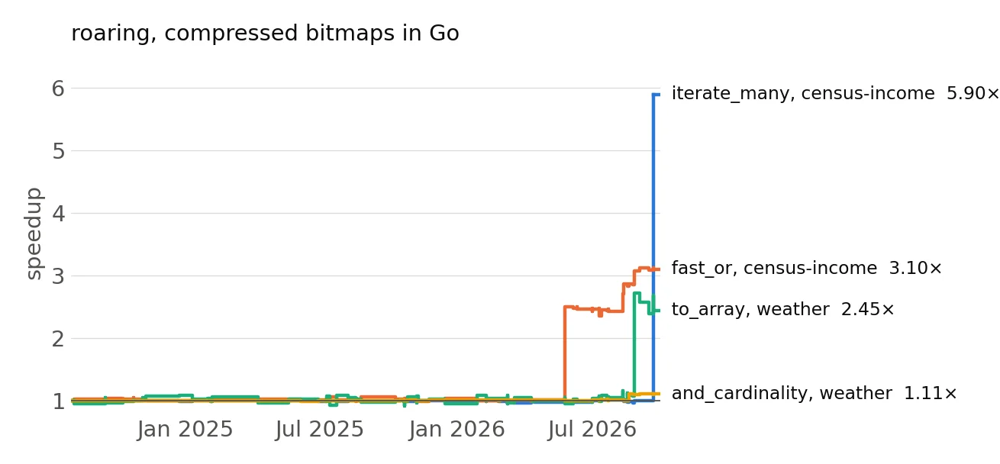
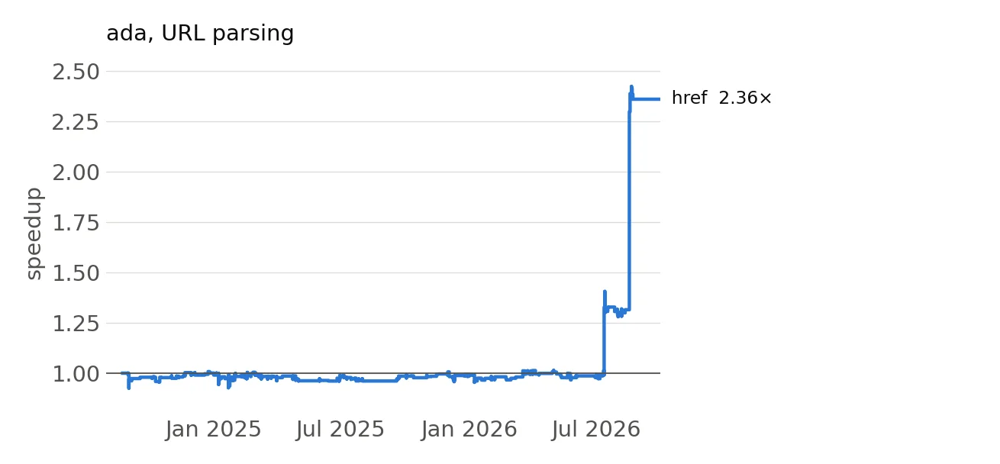
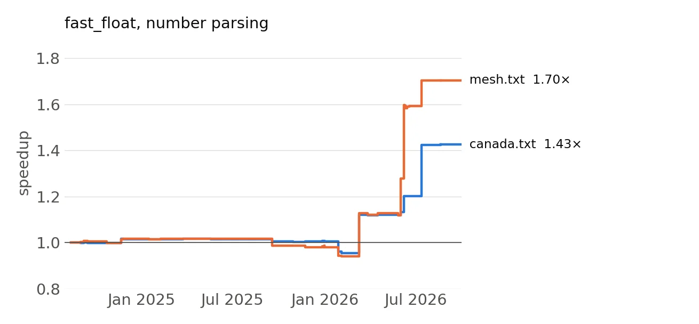
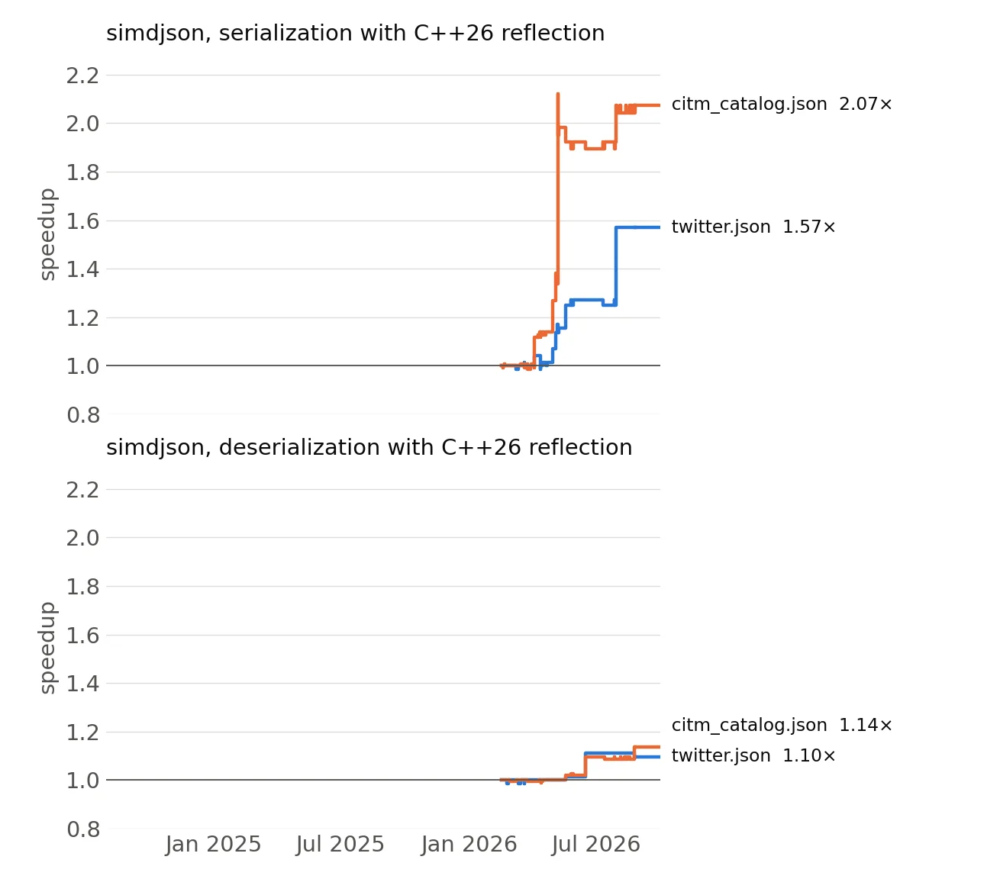
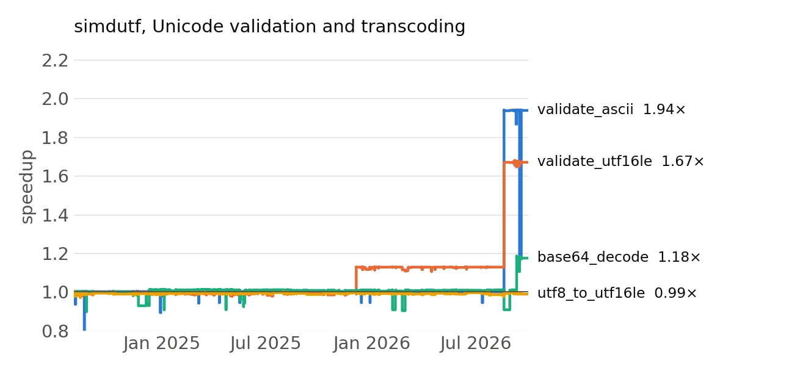
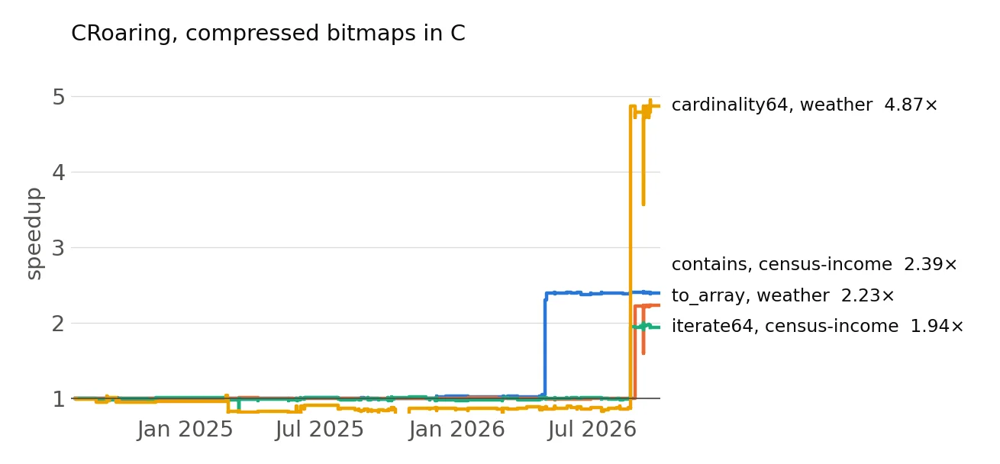

# A summer of AI optimization

I maintain and comaintain several open-source libraries. Some of them are widely used: ada parses URLs in Node.js, fast_float parses numbers in GCC's standard library and in Chromium, simdjson parses JSON in Node.js, simdutf validates and transcodes Unicode in Node.js, and the Roaring bitmap libraries sit inside many database engines.

These libraries are mature. They have been optimized for years, by me and by others. For a long time, their performance was flat. Not because nobody cared, but because the remaining gains were expensive: each one required a few days of careful work, and nobody had the days.

Then, in 2026, six of them got much faster, most of it in a few weeks of summer.

To formalize my feeling, I rebuilt every commit of each library from scratch and benchmarked it on one machine (an Intel Xeon Gold 6548N). I track the speedup over time relative to August 2024. Thus the value 1.0 means no speedup. Whereas 2.0 means that the performance doubled. The lines are steps because performance only changes at a commit. 

I should say that I cannot know how much AI was involved in each instance. I don't ask how people arrived at their code. All I ask is that it be good. As for myself, I code with Claude (Opus 5), Grok and DeepSeek (V4 Pro). I was an early adopter of Grok for coding, and it got really good over time.

## 1. roaring (compressed bitmaps, Go)

The roaring library is the Go version of the Roaring index data structure. Decoding to an array got 2.5 times faster, the multi-way union `FastOr` got 3.1 times faster on one data set, the many-value iterator got 4.5 to 5.9 times faster, and the intersection cardinality gained 10%.

One of the contributors is an AI, actually. It is [perfloop](https://www.perfloop.com). (Disclosure: I am an advisor for perfloop.)

I did a lot of work. We also got help from Philipp Klose who declared using Claude.

## 2. ada (URL parsing)

The ada library is a standard compliant URL parser. From August 2024 to July 2026, about 550 commits went in and the throughput on a corpus of 100,000 URLs stayed at 0.54 GB/s. Then, in six weeks, it went to 1.28 GB/s: 2.4 times faster, about 15 million URLs per second on one core. 

Most of the optimizations were done by Yagiz Nizipli, my long-time co-author. Yagiz works at SpaceX and uses Cursor (presumably with a grok model). Abdul Rawoof Khan and Dillon Mulroy also contributed an optimization each. I worked at optimizing IP address parsing, but it won't show in this particular benchmark.

## 3. fast_float (number parsing)

The fast_float library parses floating-point numbers from text. It is part of GCC and most browsers. Performance was flat for fifteen months. Then, from March to July 2026, it gained 43% on one file (`canada.txt`, long coordinates) and 70% on another (`mesh.txt`, short coordinates). The optimizations should be credited to  Koleman Nix and Filipe Oliveira.

## 4. simdjson (JSON serialization and deserialization with C++26 reflection)

The simdjson library recently gained support for C++26 static reflection: you serialize and parse your own structs directly, with no glue code.  Since February 2026, serialization is 1.6 times faster on `twitter.json` and 2.1 times faster on `citm_catalog.json`. Deserialization, JSON straight into a struct, gained a more modest 10% and 14% (the second panel). (The reflection code only exists since early 2026.) The number of instructions per byte fell by almost exactly the same ratio as the throughput rose: from 6.1 to 3.1 instructions per byte on `citm_catalog.json` serialization. 

Francisco Geiman Thiesen (Microsoft) did most of the work on the serialization side while I mostly helped improve our parsing. Francisco uses Claude.

## 5. simdutf (Unicode validation and transcoding)

The simdutf library validates and transcodes UTF-8, UTF-16 and UTF-32, and encodes and decodes base64. ASCII validation went from 83 GB/s to 160 GB/s. UTF-16 validation went from 62 GB/s to 102 GB/s. Base64 decoding gained 17%. 

The work was done by Yagiz Nizipli (again) and myself.

The library got other amazing optimizations that do not show up on this benchmark by Gaspard Petit and Shreesh Adiga.

## 6. CRoaring (compressed bitmaps, C)

CRoaring implements Roaring bitmaps in C. On the real data sets from the repository, membership tests (`contains`) got 2.4 times faster, the cardinality of 64-bit bitmaps got 4.9 times faster, iterating over a 64-bit bitmap got 1.9 times faster, decoding a dense bitmap to an array got 2.2 times faster. Unions gained a more modest 13% to 16%.

The authors were Andrei Gudkov and myself.

## What happened

The techniques used are all well-known. So why all these optimizations all of a sudden?
Simply put, in my view, because it got cheap to try new ideas.

There is a lot of talk about the risks of AI in software. Human beings tend to be susceptible to the one-sided bet fallacy: when we see the downsides, we tend to ignore the benefits. Cars kill people, but ambulances save them.

In this instance, the benefits are concrete. Millions of people run these libraries, and this summer, they got faster.