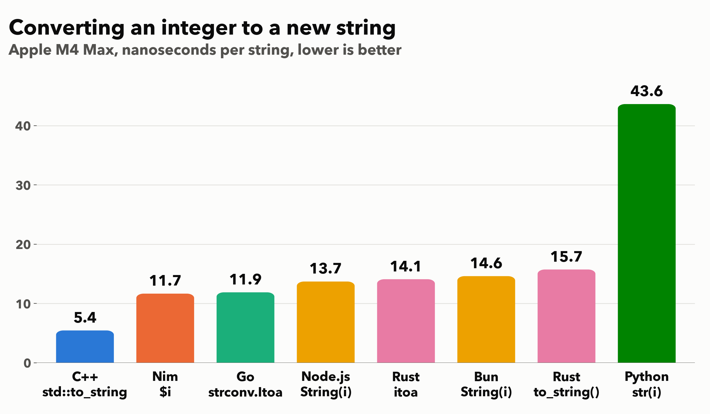

# How many strings can you create per second?

We create new strings all the time. How quickly can you produce short strings in your programming languge? To create a meaningful string,  we convert an integer to a string. In Python, that is `str(i)`. The loop stores each new string in a small ring buffer of 1024 slots, so that the engine cannot simply discard the work.

```python
def from_int(n):
    b = buf
    for i in range(n):
        b[i & 1023] = str(i)
```

In JavaScript (Node.js and Bun), I use `String(i)`:

```javascript
function from_int(n) {
  for (let i = 0; i < n; i++) buf[i & 1023] = String(i);
}
```

In C++, I use `std::to_string`:

```cpp
void from_int(uint64_t n) {
  for (uint64_t i = 0; i < n; i++) buf[i & 1023] = std::to_string(i);
}
```

In Rust, I use the standard `to_string()` and, as an alternative, the popular [itoa](https://crates.io/crates/itoa) crate, which is designed for fast integer formatting:

```rust
fn std_to_string(buf: &mut [String], n: u64) {
    for i in 0..n {
        buf[(i & 1023) as usize] = i.to_string();
    }
}

fn itoa_to_string(buf: &mut [String], n: u64) {
    let mut b = itoa::Buffer::new();
    for i in 0..n {
        buf[(i & 1023) as usize] = b.format(i).to_owned();
    }
}
```

In Go, I use `strconv.Itoa`:

```go
func fromInt(n int) {
	for i := 0; i < n; i++ {
		buf[i&1023] = strconv.Itoa(i)
	}
}
```

In Nim, I use the `$` operator:

```nim
proc fromInt(n: int) =
  for i in 0 ..< n:
    buf[i and 1023] = $i
```

The integers go from 0 to 100 million (10 million in Python), so each string has up to eight digits. I report the best of five runs on an Apple M4 Max. C++ is compiled with `-O3`, Rust in release mode, Nim with `-d:danger`. 



Python is the slowest at 44 ns per string, about three times slower than JavaScript and eight times slower than C++. 

The compiled languages that allocate each string on the heap (Rust, Go, Nim) end up in the same range as JavaScript: 12 to 16 ns per string. Rust with its standard `to_string()` is even a bit slower than Node.js and Bun. Garbage-collected runtimes like Go and JavaScript are very good at allocating many small, short-lived objects.

C++ wins by a wide margin at 5.4 ns per string. The trick is the *small string optimization*: a `std::string` stores short strings, directly inside the object. Our strings have at most eight digits, so C++ never calls the memory allocator.


**Versions used**: macOS 15.7.7, CPython 3.14.5, Node.js 25.9.0, Bun 1.4.2, Apple clang 17.0.0 (clang-1700.6.4.2) with libc++, rustc 1.94.1 with itoa 1.0.18, Go 1.24.3, Nim 2.2.12.

[Source code](https://github.com/lemire/Code-used-on-Daniel-Lemire-s-blog/tree/master/2026/09/24).
