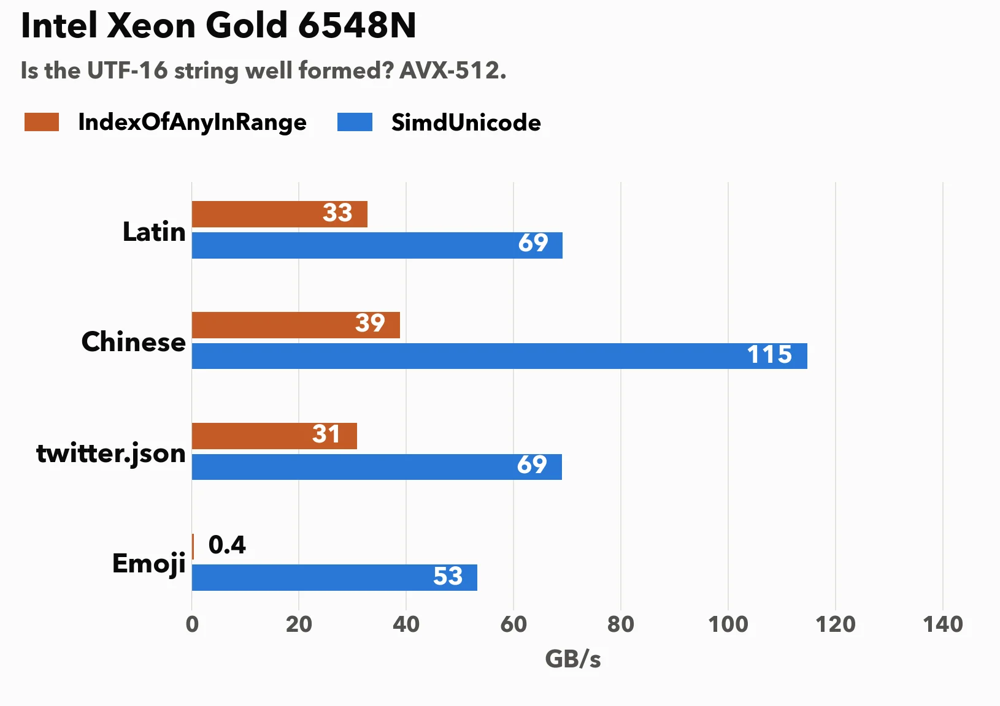
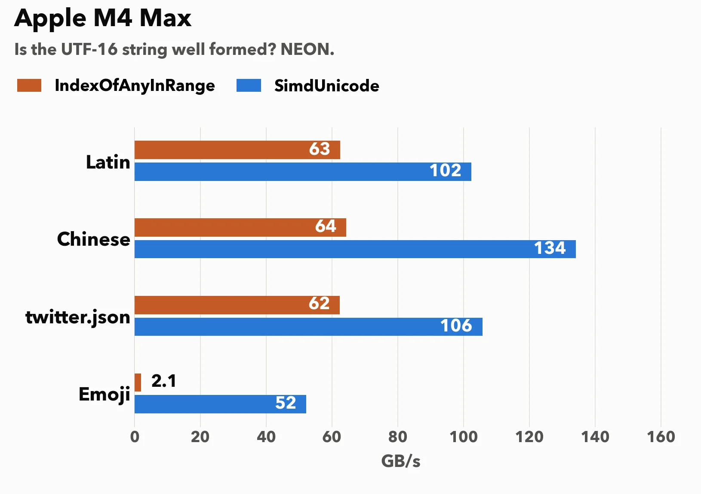
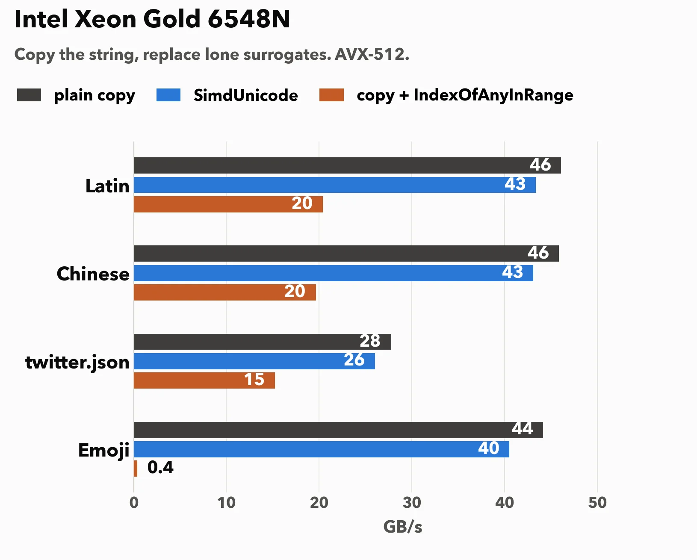
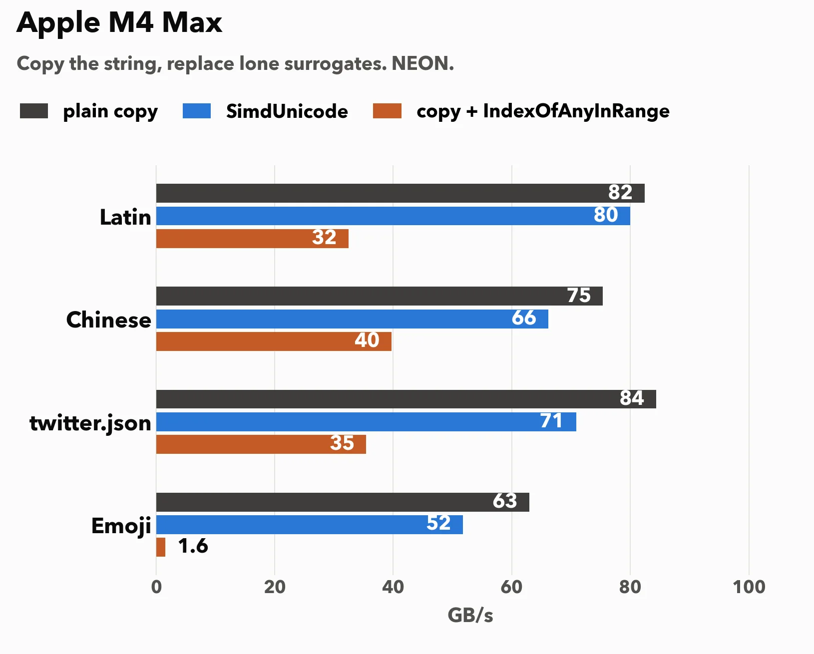

# How fast can you fix a UTF-16 string in C#?

C# strings are UTF-16. Most characters are one 16-bit code unit. Characters outside the basic multilingual plane, emoji included, take two: a *high surrogate* (U+D800 to U+DBFF) followed by a *low surrogate* (U+DC00 to U+DFFF). A surrogate with the wrong neighbor, or with none, is ill-formed.

You should never send an ill-formed string to disk or to the network. It is a bad practice.

In JavaScript, we have fast functions to fix strings or check whether they need fixing:
- `String.prototype.toWellFormed()` replaces every lone surrogate with U+FFFD. 
- `isWellFormed()` reports whether any replacement is needed.

I added both functions to my C# library [SimdUnicode](https://github.com/simdutf/SimdUnicode), in [pull request 54](https://github.com/simdutf/SimdUnicode/pull/54). The algorithm is the same that we contributed to the JavaScript engine V8, so Chrome already fixes strings this way. 

```csharp
string s = UTF16.ToWellFormed(input); // same instance, when the input is already well formed
bool ok = UTF16.IsWellFormed(span);
```

When the input is well formed, `ToWellFormed` returns it as is. No allocation.

How are strings fixed? Basically, you replace bad inputs by the replacement character `U+FFFD`.


Our processors have special instructions called SIMD that allow data parallelism: you can compare multiple values at once. Recent x64 processors from AMD and Intel have better data parallelism than ARM chips, although both have powerful instructions.


The conventional approach in C# to repair a string is a function such as the following.

```csharp
static void Repair(ReadOnlySpan<char> input, Span<char> output)
{
    input.CopyTo(output);
    int i = NextError(output, 0);
    while (i >= 0)
    {
        output[i] = '\uFFFD';
        i = NextError(output, i + 1);
    }
}

// Index of the next lone surrogate at or after 'start', or -1 if none.
static int NextError(ReadOnlySpan<char> s, int start)
{
    int i = start;
    while (true)
    {
        int k = s.Slice(i).IndexOfAnyInRange('\uD800', '\uDFFF');
        if (k < 0) return -1;
        i += k;
        if (char.IsHighSurrogate(s[i]) && i + 1 < s.Length && char.IsLowSurrogate(s[i + 1]))
            i += 2; // valid pair, skip it
        else
            return i;
    }
}
```


In SimdUnicode, I also use data parallelism. 

Let me measure.



On the Xeon, with AVX-512, Latin validates at 69 GB/s against 33 GB/s for `IndexOfAnyInRange`.
The Emoji input is well formed, and it is nothing but surrogate pairs. The runtime search drops to 0.4 GB/s. Our check holds 53 GB/s.



Our results are similar on the M4 Max, although a bit less impressive compared to the Intel results.

Validation can return at the first lone surrogate. The buffer form of `ToWellFormed` writes every code unit, a copy of the input or U+FFFD. When the input is well formed, it is effectively a memory copy. Thus we can compare the performance against a copy. 





Roughly speaking, we are consistently about as fast as a copy.


**Versions used**: .NET SDK 10.0.400 on Linux, 10.0.103 on macOS. Intel Xeon Gold 6548N (Emerald Rapids). Apple M4 Max.

Clausecker, R., & Lemire, D. (2026). [Fixing ill-formed UTF-16 strings with SIMD instructions](https://doi.org/10.1002/spe.70105). Software: Practice and Experience. ([arXiv](https://arxiv.org/abs/2601.06349))

[Source code](https://github.com/simdutf/SimdUnicode/pull/54).
