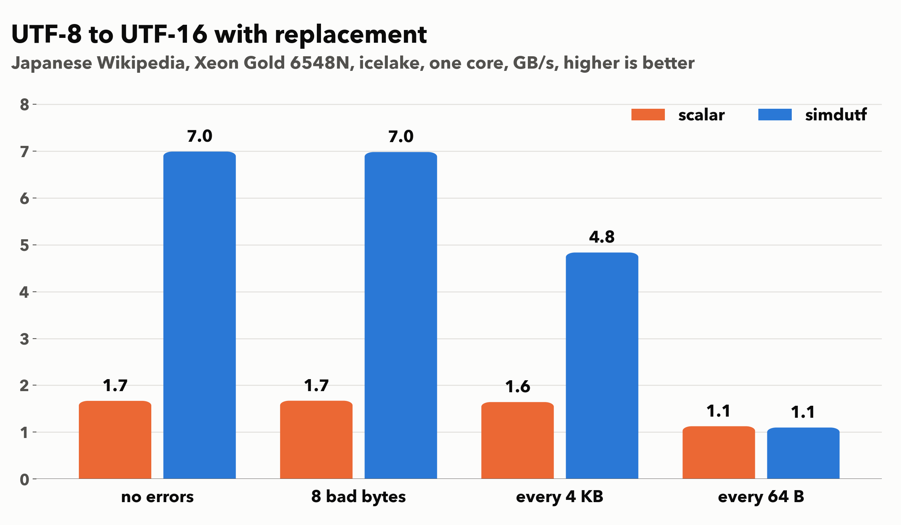
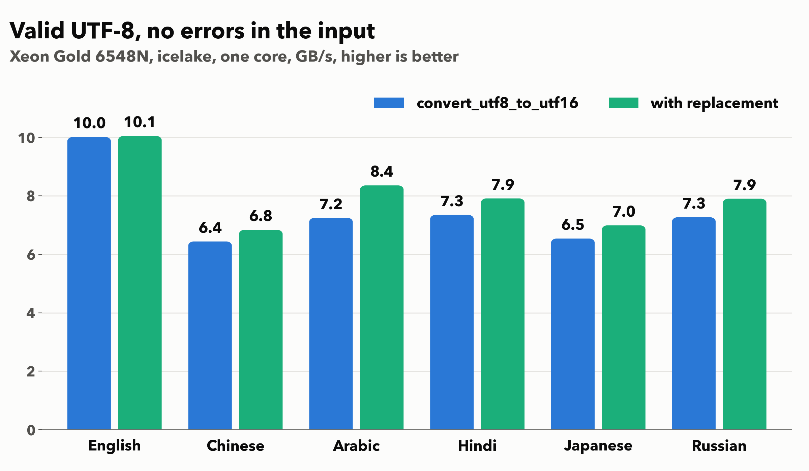

# Transcoding UTF-8 to UTF-16 with replacement at gigabytes per second

Our software represents strings using the UTF-16 or the UTF-8 formats.
Most text on the web is UTF-8, but Java, C# or JavaScript represents the
strings as UTF-16 to the programmer.

Sometimes we need to transcode (convert) strings.  Your browser probably uses the simdutf library for validating or transcoding. It is part of the widely used V8 JavaScript engine.

Up until a few days ago, the simdutf library missed one key feature: if the UTF-8 input is invalid, it did not know how to transcode it to UTF-16. The objective is to replace ill-formed UTF-8 sequences with the replacement character U+FFFD. It is the character that shows up as a weird question mark sometimes. You may have seen it in a broken web site.

The new function `convert_utf8_to_utf16_with_replacement` always succeeds. It must be used in conjunction with the function `utf16_length_from_utf8_with_replacement`, which scans and validates the input, recording the offsets of errors if there are some. The usage is as follows.

```cpp
const char source[] = {'c', 'a', 'f', '\xff'};
size_t length = 4;
simdutf::utf8_to_utf16_result res =
    simdutf::utf16_length_from_utf8_with_replacement(source, length);
std::unique_ptr<char16_t[]> utf16{new char16_t[res.count]};
size_t written = simdutf::convert_utf8_to_utf16_with_replacement(
    source, length, utf16.get(), res);
```


Because we have a list of errors before even beginning the transcoding, 
the bytes between the recorded offsets are valid UTF-8, so we can transcode faster. Each recorded error becomes one U+FFFD.

I timed a scalar decoder against the library on Japanese Wikipedia. The file is 531 KB. I repeated it so the timed buffer is 1.1 MB. I use one core of a Xeon Gold 6548N. GCC 14.3.1 at `-O3`, best of eight runs. 



With no errors, simdutf reaches 7.0 GB/s and the scalar loop 1.7 GB/s.

On valid input, the new approach may even be marginally faster than the previous method, because our initial validation pass allows us to transcode faster afterward.




**Compiler**: GCC 14.3.1, `-O3`, one core (`taskset -c 2`), simdutf icelake kernel. The functions are on the branch [`utf8-to-utf16-with-replacement`](https://github.com/simdutf/simdutf/tree/utf8-to-utf16-with-replacement).

**Credit**: The most non-trivial part of this routine was coded by 
Benjamin Bucher over the summer.