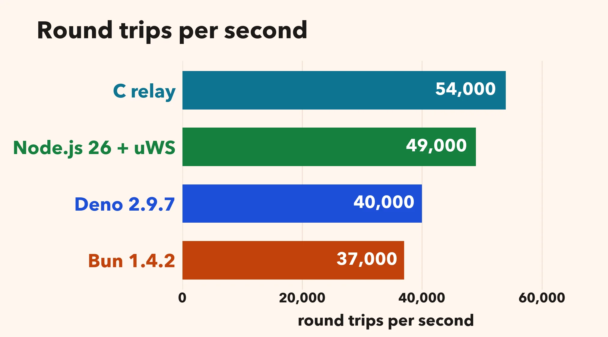
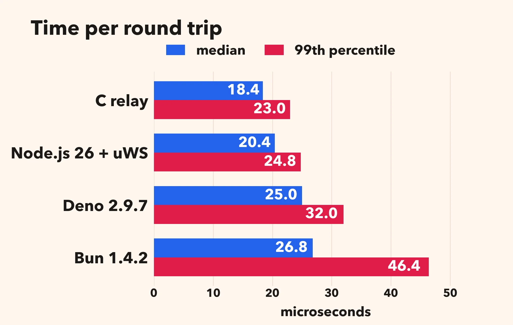
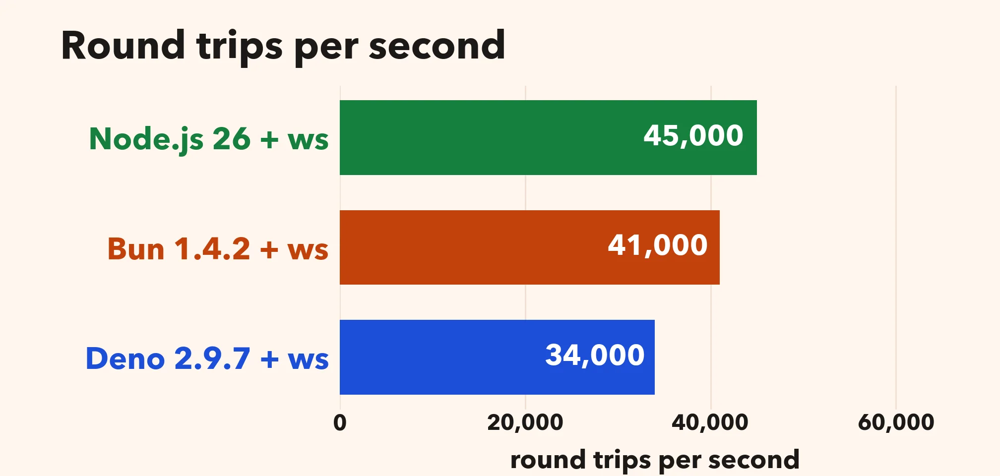
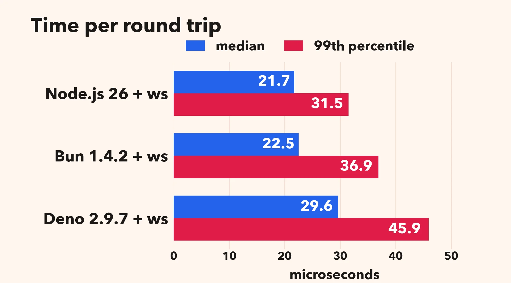

# WebSocket servers in JavaScript: Node.js, Bun and Deno in 2026

WebSocket is a standard protocol to hook up a client and a server in a persistent manner. It is commonly used for live chat, notifications, multiplayer games, collaborative editing, and streaming dashboards. Many servers are written in JavaScript and use Node.js, Bun or Deno as an engine.

A few years ago, I wrote [a simple WebSocket benchmark in JavaScript](https://lemire.me/blog/2023/11/25/a-simple-websocket-benchmark-in-javascript-node-js-versus-bun/). Two clients exchange messages through a server: client 1 sends a message to the server, the server forwards it to client 2, client 2 answers, and the server forwards the answer back to client 1. I found that Bun could be twice as fast as Node.js. That result was wrong. The Bun server sent each message back to the sender, so a round trip was two messages instead of four. Since then, Anthropic bought Bun. Also, Cloudflare bought Deno.

My benchmark had an issue: my clients were written in JavaScript, and they were slow. So I wrote a client in C. Doing so by hand in 2023 was expensive, but in 2026, my AI friends can write anything in C.

I run a single *ping-pong* test: a single pair of clients chats through the server.

I compare three servers against a small C relay:

- Node.js 26 with [uWebSockets.js](https://github.com/uNetworking/uWebSockets.js), a native addon written in C++;
- Bun 1.4.2 with its built-in server (`Bun.serve`);
- Deno 2.9.7 with its built-in server (`Deno.serve`).

My test machine is a Linux server with an Intel Xeon Gold 6548N (Emerald Rapids). Everything runs locally over the loopback interface. The server is restricted to a single core, and the client runs on another core. I repeated the whole benchmark three times: the results are stable, within a few percent.

I report the number of round trips per second and the time per round trip (median and 99th percentile).

| server | round trips/s | median (µs) | 99th percentile (µs) |
|---|---|---|---|
| C relay (reference) | 54,000 | 18.4 | 23.0 |
| Node.js 26 + uWebSockets.js | 49,000 | 20.4 | 24.8 |
| Deno 2.9.7 + Deno.serve | 40,000 | 25.0 | 32.0 |
| Bun 1.4.2 + Bun.serve | 37,000 | 26.8 | 46.4 |

A JavaScript WebSocket server can get close to a simple C server in this test. Node.js 26 with uWebSockets.js is quite a bit faster than Bun and Deno: 49,000 round trips per second, against 40,000 for Deno and 37,000 for Bun. The 99th percentile is 24.8 µs, against 32.0 µs and 46.4 µs.

## The ws package

I repeated the same ping-pong test with the [`ws`](https://github.com/websockets/ws) package, version 8.22.0, on all three runtimes. Same server code, same C client.

| server | round trips/s | median (µs) | 99th percentile (µs) |
|---|---|---|---|
| Node.js 26 + ws | 45,000 | 21.7 | 31.5 |
| Bun 1.4.2 + ws | 41,000 | 22.5 | 36.9 |
| Deno 2.9.7 + ws | 34,000 | 29.6 | 45.9 |

Node.js is ahead, then Bun, then Deno. On Node.js, `ws` is close to uWebSockets.js (45,000 against 49,000). On Bun, `ws` beats `Bun.serve` (41,000 against 37,000). On Deno, `ws` is behind `Deno.serve` (34,000 against 40,000).

**My source code is [available](https://github.com/lemire/jswebsocket_bench).**
