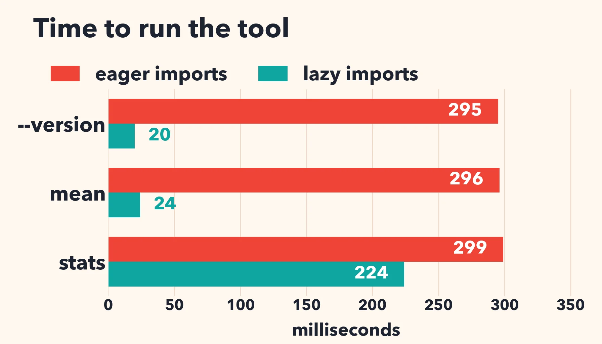

# Faster Python startup with lazy imports

When a Python program starts, it needs to load all its dependencies (`import`). With the upcoming version of Python, it is possible to use `lazy` imports instead.

```python
lazy import json
lazy from decimal import Decimal
```

In this instance, the name `json` is no longer the module, but a mere placeholder object. The actual import only happens when you use `json`. If you never use `json`, the module is never loaded.

How much does it help? Let us measure.

I wrote a toy command-line tool. It imports sixteen modules: `json`, `csv`, `decimal`, `sqlite3`, `asyncio`, `email.parser`, `http.client`, `urllib.request`, `xml.etree.ElementTree`, `zipfile`, `tarfile`, `statistics` and some popular third-party packages (`numpy`, `pandas`, `requests`, `rich`). The tool has three paths:

- `--version` prints a string and needs nothing;
- `mean` reads a small CSV file with the `csv` module and calls `statistics.fmean`;
- `stats` loads the same file with pandas and prints a summary.

The lazy version of the tool is identical, except that I prefix the imports with `lazy`. It is a one-word change per line.

I use Python 3.15 (3.15.0b4) on an Intel Xeon Gold 6548N (Emerald Rapids), with numpy 2.5, pandas 3.0 and requests 2.34. 

| command      | eager imports | lazy imports | speedup |
|--------------|--------------:|-------------:|--------:|
| `--version`  | 295 ms        | 20 ms        | 15×     |
| `mean`       | 296 ms        | 24 ms        | 12×     |
| `stats`      | 299 ms        | 224 ms       | 1.3×    |



Printing the version number goes from 295 ms to 20 ms. If you subtract the interpreter startup (11.7 ms), the cost of the imports goes from 283 ms to about 8 ms: a 35-fold reduction. The `mean` command, which needs a few standard modules, is twelve times faster.


There is a downside: errors move. With an eager import, a missing module fails at startup. With a lazy import, it fails at the first use, perhaps deep inside a function, perhaps hours later in a long-running server.

My [source code is available](https://github.com/lemire/Code-used-on-Daniel-Lemire-s-blog/tree/master/2026/10/lazy).
